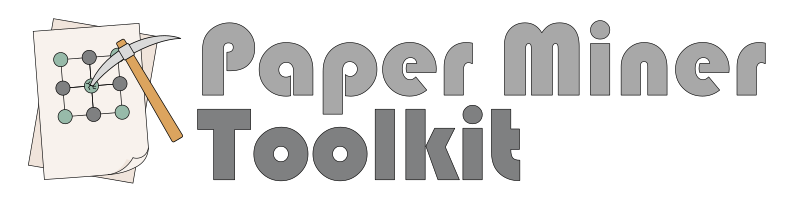

<p align="center">
  <picture>
    <source media="(prefers-color-scheme: dark)" srcset="assets/Paper_Miner_Toolkit_banner_dark.svg">
    
  </picture>
</p>

<p align="center">
  <a href="https://github.com/SMTG-Bham/PaperMinerToolkit/actions/workflows/tests.yml"></a>
  <a href="https://codecov.io/gh/SMTG-Bham/PaperMinerToolkit"></a>
  <a href="https://paperminertoolkit.readthedocs.io/en/latest/"></a>
</p>

# PaperMinerToolkit

PaperMinerToolkit builds scientific-paper corpora and extracts structured, recipe-defined data with configurable text and vision models. It searches Elsevier/Scopus, CORE, OpenAlex, PubMed, arXiv, medRxiv, bioRxiv, and chemRxiv; supplements paper metadata from Crossref, OpenAlex, PubMed, arXiv, medRxiv, bioRxiv, and chemRxiv, and imports an author's works from Crossref; downloads abstracts, full text, and PDFs; supports persistent regex and LDA topic filters; and stores source content and pipeline state in SQLite.

The complete user guide, CLI reference, Python API, HPC instructions, and rendered notebooks live in the [documentation source](https://paperminertoolkit.readthedocs.io/en/latest/). The repository is ready for Read the Docs; a hosted link will be added after the project is imported.

## Installation

PaperMinerToolkit requires Python 3.11 or newer:

```bash
git clone https://github.com/SMTG-Bham/PaperMinerToolkit.git
cd PaperMinerToolkit
python -m pip install -e .
```

## Quickstart

Configure a text model and any search/download credentials you need, then run a small workflow:

```bash
pmt config model text --provider openai --model YOUR_TEXT_MODEL

pmt search "lithium solid electrolyte" papers.db \
  --source openalex --count 25
pmt enrich papers.db
pmt download papers.db --format abstract

pmt scrape papers.db sse \
  --mode abstract \
  --output temp_scraped_materials.csv

pmt store papers.db \
  temp_scraped_materials.csv \
  materials.csv \
  sse \
  --assume-yes
```

Use `pmt corpus stats papers.db` to inspect stored content and `pmt status papers.db` to inspect pipeline progress.

## Documentation

Install and build the Sphinx site locally:

```bash
python -m pip install -e '.[docs]'
make -C docs html
```

Open `docs/_build/html/index.html`. Notebook templates for OpenAI, Anthropic, local Qwen/vLLM, LDA model selection, temporal trends, and hybrid filtering are under `docs/examples/`.

## Testing

```bash
python -m pip install -e '.[test]'
ruff check paperminertoolkit tests
pytest
```

PaperMinerToolkit is currently alpha software. Keep the corpus database, recipe, model configuration, intermediate extraction CSV, and final results together so a workflow can be reviewed and reproduced.
