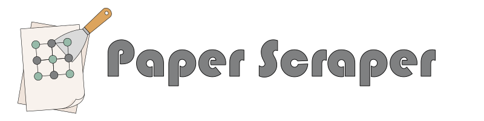
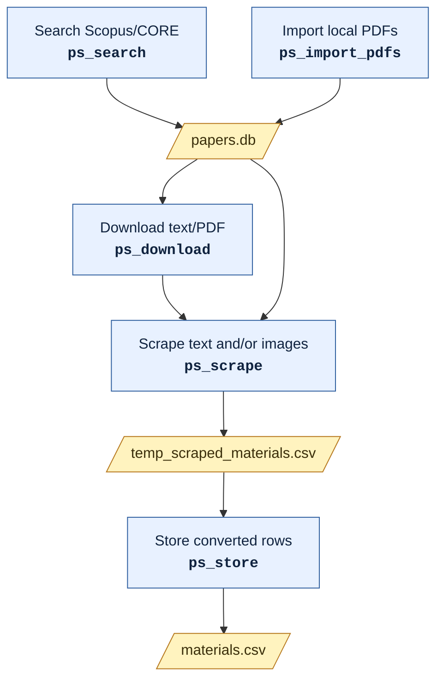

# PaperScraper

  

PaperScraper searches Elsevier/Scopus and CORE, downloads paper content through Elsevier, Unpaywall, and CORE, and extracts structured materials data from papers with configurable text and vision models.

## Model Profiles

Configure separate model profiles for text and vision analysis:

`ps_model_config text --provider local --model Qwen/Qwen3-VL-30B-A3B-Instruct --base-url http://127.0.0.1:8000/v1 --temperature 0 --top-p 1`

`ps_model_config vision --provider local --model Qwen/Qwen3-VL-30B-A3B-Instruct --base-url http://127.0.0.1:8000/v1`

Capabilities are inferred automatically from the profile and model name. Use `--capability` only as an override for unusual models. Model requests default to `temperature=0` and `top_p=1` for deterministic extraction.

Inspect configured profiles:

`ps_model_status`

Environment variables still work for batch jobs. `PAPERSCRAPER_MODEL_*` applies to the text profile, while `PAPERSCRAPER_VISION_MODEL_*` applies to the vision profile.

## Workflow

PaperScraper can start from an Elsevier/Scopus or CORE search, PDFs you have already downloaded, or a mixture of both. Paper metadata, pipeline state, and compressed source documents are stored in a SQLite corpus. Matching DOI, source ID, and title/year records are merged so the same paper is not scraped twice.

### Configure Models

Configure model profiles before scraping. The text profile is used for text extraction, unit conversion, and text/image reconciliation; the vision profile is used for `--mode images` and `--mode text-images`. See [Model Profiles](#model-profiles) for setup commands.

### Build A Paper Corpus

Search Elsevier/Scopus and CORE and write streamlined metadata to a SQLite corpus:

`ps_search "Lithium solid electrolyte" papers.db`

Choose one source when needed:

`ps_search "Lithium solid electrolyte" papers.db --source core --count 100`

CORE can use `CORE_API_KEY` from the environment or a saved key:

`ps_core_key`

Or import externally downloaded PDFs. This scans each PDF for a DOI, uses Crossref to fill metadata when possible, and stores the PDF in the corpus. Matching records are updated and unmatched PDFs are appended:

`ps_import_pdfs papers papers.db`

For offline runs, skip Crossref lookup while still trying to extract the DOI from the PDF text:

`ps_import_pdfs papers papers.db --no-crossref`

If you do not have PDFs yet, discover one author's DOI-bearing works through Crossref. An ORCID is strongly preferred because author-name searches can be ambiguous:

`ps_import_author supervisor.db --orcid 0000-0000-0000-0000 --email you@example.ac.uk --review-csv supervisor_works.csv`

If no ORCID is available, use the author's full name and, where Crossref has deposited affiliation metadata, restrict the match further:

`ps_import_author supervisor.db --author "First Family" --affiliation "University of Example" --email you@example.ac.uk --review-csv supervisor_works.csv`

Inspect the review CSV before downloading. Crossref supplies metadata and DOIs rather than guaranteed PDF access, so the next step uses the configured Unpaywall, CORE, and Elsevier download sources.

### Download Paper Content

Use this step for papers discovered by search. External PDF imports already point at local PDFs and do not need this.

`ps_download papers.db --format text`

`ps_download papers.db --format pdf`

`ps_download papers.db --format both`

PDF downloads default to every configured source: Unpaywall when `UNPAYWALL_EMAIL` is set, CORE when `CORE_API_KEY` is set, and Elsevier when `ELSEVIER_API_KEY` is set. Choose specific PDF sources by repeating `--source`, for example `ps_download papers.db --format pdf --source unpaywall --source core`. If a PDF is found through Unpaywall or CORE and Elsevier full text is also available for that row, PaperScraper still downloads the Elsevier text.

### Choose A Recipe

The recipe argument can be a bundled recipe name such as `sse`, or a path to an external JSON recipe file. Use the same recipe when scraping and storing.

`ps_scrape papers.db sse --mode text`

`ps_scrape papers.db ./my_recipe.json --mode text`

`ps_store papers.db temp_scraped_materials.csv materials.csv ./my_recipe.json --assume-yes`

### Scrape Papers

Scrape text only:

`ps_scrape papers.db sse --mode text`

Scrape images with the vision profile:

`ps_scrape papers.db sse --mode images --vision-provider local --vision-model Qwen/Qwen3-VL-30B-A3B-Instruct --vision-base-url http://127.0.0.1:8000/v1`

Scrape text and images together, using paper text as image context:

`ps_scrape papers.db sse --mode text-images --image-context paper-text`

When text and image scraping both produce records for a paper, PaperScraper asks the text model to reconcile them and merge matching materials into combined `text+image` rows.

Image extraction defaults to `--image-extraction auto`: embedded PDF images are used when available, otherwise pages are rendered to PNGs for vision analysis. Use `--image-extraction pages` to always render pages, or `--image-extraction embedded` to disable the fallback.

By default, image scraping sends one image per vision request. Use `--image-batch-size 4` for small batches or `--image-batch-size all` to send every extracted image for a paper in one request.

### Reruns And Cleanup

By default, successful scrape stages are skipped on rerun. Rescrape them with:

`ps_scrape papers.db sse --mode text --force`

Use a named scrape output file for batch runs:

`ps_scrape papers.db sse --mode text --output scraped_materials.csv`

Delete extracted images after successful image analysis:

`ps_scrape papers.db sse --mode images --delete-images-after`

### Store And Inspect Results

Store newly scraped rows, converting units according to the recipe:

`ps_store papers.db temp_scraped_materials.csv materials.csv sse --assume-yes`

Check pipeline status:

`ps_status papers.db`

## Testing

Install the test dependencies and run the default test suite with:

`pip install -e ".[test]"`

`pytest`

Unit tests live in `tests/` and should be split by source file, for example `tests/test_corpus.py` covers `paperscraper/corpus.py`. If test data files are needed, put them in `tests/data/`. Tests that call live external services should be marked with `@pytest.mark.network`; the default test command skips those so CI can run without API keys.

## Example Notebooks

The examples folder contains notebooks with explained bash cells for common model providers:

- `examples/qwen_vllm_workflow.ipynb` starts a local vLLM OpenAI-compatible server, configures text and vision profiles, then runs search, download, and scrape.
- `examples/openai_gpt_workflow.ipynb` configures OpenAI GPT profiles and runs search, download, scrape, and store.
- `examples/anthropic_claude_workflow.ipynb` configures Anthropic profiles and runs search, download, scrape, and store.

Before running them, configure the search/download credentials you want to use, such as `ELSEVIER_API_KEY`, `CORE_API_KEY`, and `UNPAYWALL_EMAIL`. The API notebooks also assume `OPENAI_API_KEY` or `ANTHROPIC_API_KEY` is available; you can save those with `ps_openai_key` or `ps_anthropic_key`.
