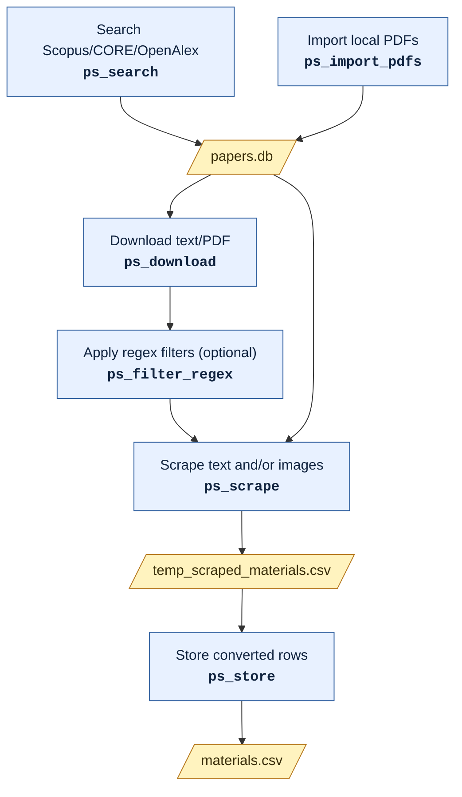

# PaperScraper

[](https://github.com/SMTG-Bham/PaperScraper/actions/workflows/tests.yml)
[](https://codecov.io/gh/SMTG-Bham/PaperScraper)

<p align="center">
  
</p>

PaperScraper searches Elsevier/Scopus, CORE, and OpenAlex, downloads paper content through Elsevier, Unpaywall, CORE, and OpenAlex, and extracts structured materials data from papers with configurable text and vision models.

## Model Profiles

Configure separate model profiles for text and vision analysis:

`ps_model_config text --provider local --model Qwen/Qwen3-VL-30B-A3B-Instruct --base-url http://127.0.0.1:8000/v1 --temperature 0 --top-p 1`

`ps_model_config vision --provider local --model Qwen/Qwen3-VL-30B-A3B-Instruct --base-url http://127.0.0.1:8000/v1`

Capabilities are inferred automatically from the profile and model name. Use `--capability` only as an override for unusual models. Model requests default to `temperature=0` and `top_p=1` for deterministic extraction.

Inspect configured profiles:

`ps_model_status`

Environment variables still work for batch jobs. `PAPERSCRAPER_MODEL_*` applies to the text profile, while `PAPERSCRAPER_VISION_MODEL_*` applies to the vision profile.

## Workflow

PaperScraper can start from an Elsevier/Scopus, CORE, or OpenAlex search, PDFs you have already downloaded, or a mixture of both. Paper metadata, pipeline state, and compressed source documents are stored in a SQLite corpus. Matching DOI, source ID, and title/year records are merged so the same paper is not scraped twice.



### Configure Models

Configure model profiles before scraping. The text profile is used for text extraction, unit conversion, and text/image reconciliation; the vision profile is used for `--mode images` and `--mode text-images`. See [Model Profiles](#model-profiles) for setup commands.

### Build A Paper Corpus

Search Elsevier/Scopus, CORE, and OpenAlex and write streamlined metadata to a SQLite corpus:

`ps_search "Lithium solid electrolyte" papers.db`

Choose one source when needed:

`ps_search "Lithium solid electrolyte" papers.db --source core --count 100`

CORE can use `CORE_API_KEY` from the environment or a saved key:

`ps_core_key`

OpenAlex answers requests without a key, but meters them against a small daily credit budget that works out at roughly 100 search pages per day:

`ps_search "Lithium solid electrolyte" papers.db --source openalex --count 100`

A free key from <https://openalex.org/settings/api> raises that budget tenfold, which any real corpus build needs. Set `OPENALEX_API_KEY` in the environment or save it:

`ps_openalex_key`

Or import externally downloaded PDFs. This scans each PDF for a DOI, uses Crossref to fill metadata when possible, and stores the PDF in the corpus. Matching records are updated and unmatched PDFs are appended:

`ps_import_pdfs papers papers.db`

For offline runs, skip Crossref lookup while still trying to extract the DOI from the PDF text:

`ps_import_pdfs papers papers.db --no-crossref`

If you do not have PDFs yet, discover one author's DOI-bearing works through Crossref. An ORCID is strongly preferred because author-name searches can be ambiguous:

`ps_import_author supervisor.db --orcid 0000-0000-0000-0000 --email you@example.ac.uk --review-csv supervisor_works.csv`

If no ORCID is available, use the author's full name and, where Crossref has deposited affiliation metadata, restrict the match further:

`ps_import_author supervisor.db --author "First Family" --affiliation "University of Example" --email you@example.ac.uk --review-csv supervisor_works.csv`

Inspect the review CSV before downloading. Crossref supplies metadata and DOIs rather than guaranteed PDF access, so the next step uses the configured Unpaywall, CORE, and Elsevier download sources.

### Download Paper Content

Use this step for papers discovered by search. External PDF imports already point at local PDFs and do not need this.

`ps_download papers.db --format text`

`ps_download papers.db --format pdf`

`ps_download papers.db --format both`

PDF downloads default to every configured source: Unpaywall when `UNPAYWALL_EMAIL` is set, OpenAlex always, drawing on `OPENALEX_API_KEY` when set, CORE when `CORE_API_KEY` is set, and Elsevier when `ELSEVIER_API_KEY` is set. Choose specific PDF sources by repeating `--source`, for example `ps_download papers.db --format pdf --source unpaywall --source openalex`. If a PDF is found through Unpaywall, OpenAlex, or CORE and Elsevier full text is also available for that row, PaperScraper still downloads the Elsevier text.

### Filter Downloaded Papers

Regex filters run after downloading and tag papers in the corpus without deleting papers or changing their scrape statuses. A definition names the filter, selects fields, and provides positive and optional veto patterns:

```json
{
  "name": "band-gap-materials",
  "description": "Papers concerning semiconductor band gaps",
  "fields": ["title", "abstract", "full_text"],
  "case_sensitive": false,
  "include_mode": "any",
  "timeout_ms": 500,
  "include": [
    {"name": "band-gap", "pattern": "\\bband[ -]?gaps?\\b"},
    {"name": "electronic-gap", "pattern": "\\belectronic\\s+gaps?\\b"}
  ],
  "exclude": [
    {"name": "irrelevant-review", "pattern": "\\breview of unrelated systems\\b"}
  ]
}
```

Apply the first filter, then add further named filters with explicit operators:

```bash
ps_filter_regex papers.db band_gap.json
ps_filter_regex papers.db experimental.json --join or
ps_filter_regex papers.db oxide.json --join and
```

The `examples/filters` directory contains three title-only definitions that demonstrate the same sequence.

Operators are evaluated from left to right. The example is stored and displayed as `((band-gap-materials OR experimental) AND oxide)`. Within one definition, `include_mode` can be `any` or `all`; any matching exclude rule vetoes that filter. Use repeatable `--field` options or `--timeout-ms` to override and persist the corresponding JSON settings for that application.

The command searches stored text first and falls back to extracting downloaded PDF text. Reference sections are ignored. Papers are marked `unavailable` when selected content is missing, unreadable, or times out and no available field proves a positive match. Inspect the active expression and counts at any time:

```bash
ps_filter_status papers.db
```

Replacing a filter requires `--replace`. Remove one filter or clear the stack with:

```bash
ps_filter_reset papers.db --name experimental
ps_filter_reset papers.db --all
```

When filters are active, `ps_scrape` prints the complete expression and processes only the final `included` papers. Use `--ignore-filters` for an explicit one-run bypass. With no active filters, scraping retains its original all-paper behavior.

### Train And Inspect LDA Topics

Train a reproducible LDA model from titles and abstracts. The model uses count vectors and online learning by default, making it suitable for larger corpora:

`ps_topics_train papers.db topic_model --topics 12`

Bigram features such as `lithium_metal`, `ionic_conductivity`, and `solid_electrolyte` are enabled by default. Use `--ngram-max 1` for a unigram-only model.

Corpus-specific stopwords can remove generic standalone terms while retaining meaningful bigrams. The file must contain one word per line, with optional comments beginning with `#`:

```text
# Words common to the complete search corpus
lithium
battery
study
performance
```

`ps_topics_train papers.db topic_model --topics 12 --stopwords-file domain_stopwords.txt`

Choose the input fields explicitly when required. Repeating `--field` combines fields:

`ps_topics_train papers.db topic_model --topics 12 --field title --field text`

Training reports warnings for small corpora, short documents, missing text, and small retained vocabularies. The model directory contains the fitted model and vectorizer, configuration and corpus fingerprints, topic terms, representative papers, and long-form per-paper probabilities.

Inspect the top terms and representative papers before assigning names:

`ps_topics_show topic_model`

Topic names are manual metadata and do not modify the fitted model:

`ps_topics_name topic_model 0 "sulfide solid electrolytes"`

Apply the saved model to a new or updated corpus:

`ps_topics_predict topic_model new_papers.db new_paper_topics.csv`

Papers containing no terms from the fitted vocabulary are marked `no_vocabulary_terms` rather than receiving misleading uniform probabilities. Topic probability exports are designed to support the subsequent temporal-trend and filtering stages.

Before choosing a topic count, train a comparison grid from one corpus load:

```bash
ps_topics_compare papers.db topic_comparison \
    --topics 6 --topics 8 --topics 10 \
    --seed 0 --seed 1 --seed 2 \
    --field abstract \
    --stopwords-file domain_stopwords.txt
```

`model_comparison.csv` reports perplexity, log likelihood, topic diversity, dominant-topic balance, training time, and cross-seed topic stability. These metrics help narrow the candidates, but the final choice should still be based on `ps_topics_show` and the representative papers.

### Choose A Recipe

The recipe argument can be a bundled recipe name, or a path to an external JSON recipe file. Use the same recipe when scraping and storing.

Bundled recipes:

- `sse` extracts lithium-conducting solid electrolytes: composition, structure, conductivity, and electrochemical properties.
- `polymer` extracts polymers: identity and architecture, printed SMILES and BigSMILES line notations, thermal, molecular weight and mechanical properties, and biodegradation test results.
- `polymer_db` is a wider version of `polymer` matching a polymer property database schema. It adds monomer CAS numbers, backbone linkage, microstructure, chain end groups, ionic character, elemental composition, functional group numbers, Mark-Houwink and hydrodynamic parameters, solubility and Hansen parameters, in vitro acid, base, hydrolytic and enzymatic degradation curves, and the full OECD 301 and 310 biodegradation test setup and results.
- `band_gap_validation` produces one record per material with separate lists for its principal gaps, all gaps reported by the study, and cited literature gaps.

`ps_scrape papers.db sse --mode text`

`ps_scrape papers.db polymer --mode text`

`ps_scrape papers.db polymer_db --mode text`

`ps_scrape papers.db band_gap_validation --mode text --output temp_band_gaps.csv`

`ps_scrape papers.db ./my_recipe.json --mode text`

`ps_store papers.db temp_scraped_materials.csv materials.csv ./my_recipe.json --assume-yes`

Store each recipe into its own materials file. When the output file already exists, its existing columns are reused for column matching, so mixing recipes in one file will not work.

The `band_gap_validation` recipe keeps this-study and cited values separate. Every populated gap field is a JSON list, including when it contains only one value. Each item has fixed `value`, `method_or_source`, `gap_type`, and `conditions` keys, using `"None"` for unsupported context. Different methods and gap types for one material remain in the same material record. Papers without relevant band-gap materials return no records. PaperScraper appends its normal `Paper id`, `doi`, publication-date, and source-provenance columns to the extracted fields.

The `polymer` and `polymer_db` recipes only record SMILES, BigSMILES, CAS numbers, and other structure identifiers that are printed as text in the paper or its supporting information. They never build a structure string from a polymer name or from a drawn structure, so these columns are often empty. `polymer_db` treats its `Structural confidence`, `Klimisch score`, and `GLP compliance` fields the same way: they are reported only when a paper states them, and are otherwise left for a curator to fill in. Copy a recipe to your own JSON file and edit its prompts if you want different behaviour.

`polymer_db` defines 86 fields, so each extracted record costs roughly 1100 output tokens and a paper reaching the 10000 token response limit will return about nine records before the response is truncated. Prefer `polymer` for papers that report long sample series, and `polymer_db` when the full property schema matters. Storing `polymer_db` results runs 30 unit conversions, one per unit-bearing column, regardless of how many rows were scraped.

### Scrape Papers

Scrape text only:

`ps_scrape papers.db sse --mode text`

Scrape images with the vision profile:

`ps_scrape papers.db sse --mode images --vision-provider local --vision-model Qwen/Qwen3-VL-30B-A3B-Instruct --vision-base-url http://127.0.0.1:8000/v1`

Scrape text and images together, using paper text as image context:

`ps_scrape papers.db sse --mode text-images --image-context paper-text`

When text and image scraping both produce records for a paper, PaperScraper asks the text model to reconcile them and merge matching materials into combined `text+image` rows.

If a paper still exceeds the configured model input limit after optional compression, PaperScraper splits its text into independent model requests. It prints a warning because records extracted from separate chunks are not automatically reconciled and may be duplicated or incomplete across chunk boundaries. The corpus records the latest plan in `num_text_chunks` or `num_abstract_chunks`: `1` means the input fitted one request, a larger value means it was split, and a missing value means chunking was not recorded. `ps_corpus_status papers.db` reports how many paper inputs were split.

Image extraction defaults to `--image-extraction auto`: embedded PDF images are used when available, otherwise pages are rendered to PNGs for vision analysis. Use `--image-extraction pages` to always render pages, or `--image-extraction embedded` to disable the fallback.

By default, image scraping sends one image per vision request. Use `--image-batch-size 4` for small batches or `--image-batch-size all` to send every extracted image for a paper in one request.

### Reruns And Cleanup

By default, successful scrape stages are skipped on rerun. Rescrape them with:

`ps_scrape papers.db sse --mode text --force`

Use a named scrape output file for batch runs:

`ps_scrape papers.db sse --mode text --output scraped_materials.csv`

Delete extracted images after successful image analysis:

`ps_scrape papers.db sse --mode images --delete-images-after`

### Store And Inspect Results

Store newly scraped rows, converting units according to the recipe:

`ps_store papers.db temp_scraped_materials.csv materials.csv sse --assume-yes`

Check pipeline status:

`ps_status papers.db`

## Testing

Install the test dependencies and run the default test suite with:

`pip install -e ".[test]"`

Validate NumPy-style docstrings:

`ruff check paperscraper tests`

Run the test suite:

`pytest`

Unit tests live in `tests/` and should be split by source file, for example `tests/test_corpus.py` covers `paperscraper/corpus.py`. If test data files are needed, put them in `tests/data/`. Tests that call live external services should be marked with `@pytest.mark.network`; the default test command skips those so CI can run without API keys.

## Example Notebooks

The examples folder contains notebooks with explained bash cells for common model providers:

- `examples/qwen_vllm_workflow.ipynb` starts a local vLLM OpenAI-compatible server, configures text and vision profiles, then runs search, download, and scrape.
- `examples/openai_gpt_workflow.ipynb` configures OpenAI GPT profiles and runs search, download, scrape, and store.
- `examples/anthropic_claude_workflow.ipynb` configures Anthropic profiles and runs search, download, scrape, and store.

Before running them, configure the search/download credentials you want to use, such as `ELSEVIER_API_KEY`, `CORE_API_KEY`, `UNPAYWALL_EMAIL`, and `OPENALEX_API_KEY`. The API notebooks also assume `OPENAI_API_KEY` or `ANTHROPIC_API_KEY` is available; you can save those with `ps_openai_key` or `ps_anthropic_key`.

## Running On HPC

The vLLM notebook assumes a local CUDA workstation. For ASU's Sol supercomputer, `examples/sol_gaudi/` holds ready-to-submit scripts for the Intel Gaudi accelerators:

They are set up for the biodegradable polymer workflow, defaulting to the `polymer` recipe and an OECD 301 search query; override `PS_RECIPE` and the query for anything else. Every script is submitted from that directory — `cd examples/sol_gaudi` first — and the job logs, `papers.db`, and the CSVs are written back there beside the scripts.

- `examples/sol_gaudi/install.sbatch` builds the environment and verifies it, keeping the CUDA build of torch out of a Gaudi node. Run this first.
- `examples/sol_gaudi/fetch_corpus.sh` runs search and download off the Gaudi queue, since neither stage calls the model.
- `examples/sol_gaudi/fetch_corpus.sbatch` submits that same corpus build as an `htc` batch job for larger runs.
- `examples/sol_gaudi/scrape_gaudi.sbatch` starts a vLLM server on one Gaudi card and runs scrape and store against it in the same job.
- `examples/sol_gaudi/serve_gaudi.sbatch` keeps a warm server up for reuse across several runs.

`examples/sol_gaudi/README.md` is the install guide for them, covering environment setup and the context sizing rule that local runs never hit.
